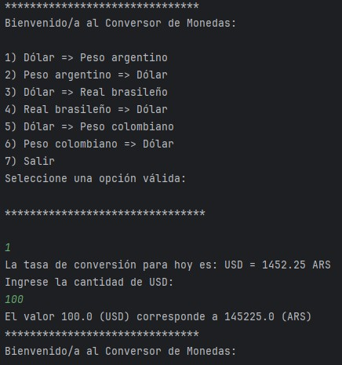

# 💱 Conversor de Monedas - Challenge ONE

 

Bienvenido al **Conversor de Monedas**, un desafío backend desarrollado como parte del programa **Oracle Next Education (ONE)** en alianza con **Alura Latam**.

Este proyecto permite realizar conversiones de divisas en tiempo real consumiendo una API externa, aplicando conceptos fundamentales de Java y Programación Orientada a Objetos.

## 🖥️ Demostración



## 🚀 Características

- **Conversión en Tiempo Real:** Obtiene las tasas de cambio actualizadas al instante.
- **Menú Interactivo:** Interfaz de consola fácil de usar con opciones predefinidas.
- **Soporte de Múltiples Monedas:**
  - 🇺🇸 Dólar (USD)
  - 🇦🇷 Peso Argentino (ARS)
  - 🇧🇷 Real Brasileño (BRL)
  - 🇨🇴 Peso Colombiano (COP)
- **Manejo de Errores:** Control de excepciones para entradas inválidas o fallos de conexión.

## 🛠️ Tecnologías Utilizadas

- **Java JDK 21(LTS)**: Lenguaje principal.
- **Gson (Google):** Librería para el parseo de JSON a objetos Java.
- **Java HttpClient:** Para realizar las peticiones HTTP a la API.
- **ExchangeRate-API:** Fuente de los datos de conversión.

## 📂 Estructura del Proyecto

El código está organizado siguiendo buenas prácticas de POO:

- `Conversor`: Punto de entrada, contiene el menú y la interacción con el usuario.
- `Consulta`: Se encarga de la conexión con la API y la obtención de datos.
- `CalculadoraDeCambio`: Contiene la lógica matemática y de presentación.
- `Moneda`: Un `record` para modelar los datos recibidos (DTO).

## 🔧 Instalación y Uso

1. **Clonar el repositorio:**
   ```bash
   git clone [https://github.com/](https://github.com/)[TU-USUARIO]/conversor-monedas.git
2. **Importar en tu IDE:**
- Abrir el proyecto en IntelliJ IDEA (recomendado) o Eclipse.
- Esperar a que se carguen e indexen los archivos.
- Configurar la dependencia Gson:
  - Asegurate de que la librería Gson esté agregada a las dependencias del proyecto.
  - En IntelliJ: File > Project Structure > Modules > Dependencies > + > Library > "com.google.code.gson:gson:2.10.1".

3. 🔑 **Configuración de la API Key (Importante):**
- Este proyecto utiliza la ExchangeRate-API. Registrate gratis en su sitio web para obtener tu propia API Key.
  - Abrir el archivo src/Consulta.java (o la ruta donde esté tu clase de servicio).
  - Buscar la línea de código:
      URI direccion = URI.create("https://...)
  - Reemplazar el texto "TU-API-KEY-AQUI" con la clave que obtuviste.
  - Ejecutar el Proyecto desde la clase Conversor.java.

## ✒️ Autor

**Melanie Ailén Peralta**

* **Rol:** Estudiante de Desarrollo de Software
* **Programa:** Oracle Next Education (ONE) - Alura Latam

[](https://www.linkedin.com/in/peralta-ailen) 
[](https://github.com/ailenperalta)
